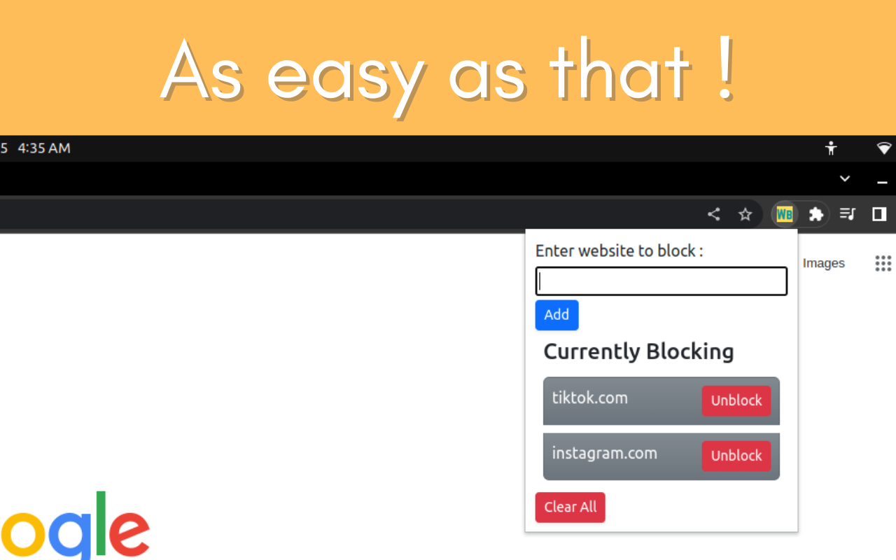

# weblock
Chrome extension for blocking websites.

User can add websites of their choice that they want to be blocked.
There can be many reasons for doing so.
* Increasing productivity.
* Lesser distractions.
* Child Safety
* Privacy

Any subdomainns of the websites will also be blocked.\
For example, if you add `google.com` to the list, `mail.google.com` will also be blocked.

Screenshot: 

***This is neither complete and nor perfect in all sense. Currently, it just acheives what is needed. Surely a lot can be done. If you want to contribute, you are welcome.***

Author : Harshit Katiyar\
**Built overnight on 14/10/22**
